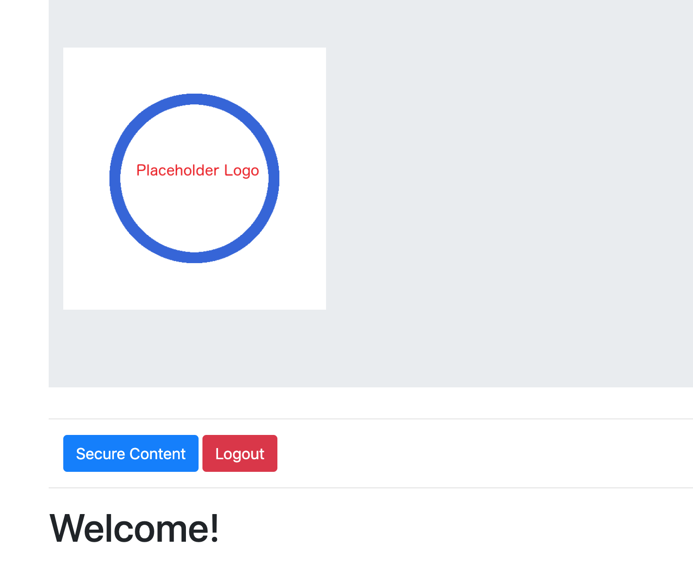

# Django Project Setup Support Package

## Overview

The purpose of this package is to help me get started quickly on a new
Django project based on my most common starting requirements. If those
same starting requirements line up with the needs of others, then it
is hoped this package may also prove useful to people other than
myself.

It is mostly to mitigate the frustration of moving to a new Django
project a few months after a previous one, and then having to check
documentation on the process of starting a fresh project.

## Dependencies

* Python 3.x
* Availability of jQuery 3.4.0 (may require network connection at setup time)
* Availability of Bootstrap 4 (may require network connection at setup time)

## Features

Running setup.sh with a project name, and an app name (optional but a common use-case) will:

* Create a new python 3.x virtualenv environment.
* Start the virtual environment, and install Django in that sandbox.
* Initialize the project.
* Initialize the app.
* Create the necessary static and template folders for the app.
* Replace the settings.py file of the project with one that has the app installed.
* Replace the urls.py file of the project with one that also includes the
urls.py file specified by the app. This allows all app-related url paths to be neatly
defined in the context of the app's functionality.
* Request the creation of a admin account for secure pages.
* Maintain example files for the inclusion of database models, and model forms. These
can then serve as reference material for apps that require database access.

### The App

* Will default to using jQuery and Bootstrap 4.
* Will default to using [Class-based Views in Django](https://docs.djangoproject.com/en/2.2/topics/class-based-views/).
* Will default to a public Bootstrap 4 Jumbotron splash page with a stub logo and a favicon, and a
link to a page for secure content.
* Will default to a single page for secure content with access granted to the admin account.
* Will possess basic login/logout functionality.

## Example Use-Case

* ./setup.sh project app
* Script requests admin name, email, and password.
* cd myproject; source env/bin/activate
* cd myproject; python manage.py runserver
* browse to 127.0.0.1:8000 to see main view (Jumbotron splash page)

## Todos

* Currently none.
