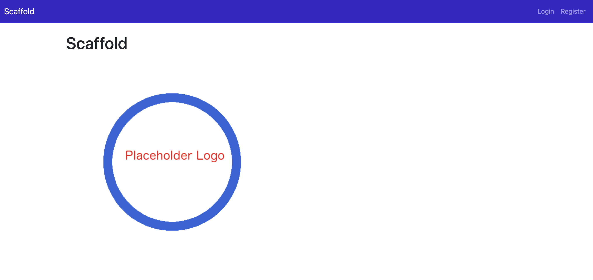

# Django Project Setup Support Package

## Overview

The purpose of this package is to help people get started quickly on a new
Django project based on my own most common starting requirements:

1. Targeted for Single-Page Applications with a React Frontend in mind.
1. For use with the Django REST API Framework.
1. Basic User Accounts support.

Much of the basic template codes for the above functionality are derived 
and distilled from the YouTube course content generously made available by 
Coding For Entrepreneurs.

* Video link: https://youtu.be/f1R_bykXHGE.
* GitHub Repo of their course code: https://github.com/codingforentrepreneurs/Tweetme-2.

## Dependencies

* Python >=3.9
* Pipenv >=2020.8.13
* Django == 2.2.16 (LTS)

## Getting Started

* ./setup.sh project target-folder
* The script will request a superuser name, email, and password.
* Navigate to target-folder.
* pipenv shell
* python manage.py runserver
* browse to 127.0.0.1:8000.

## Release Notes

See [docs/Release.md](docs/Release.md).